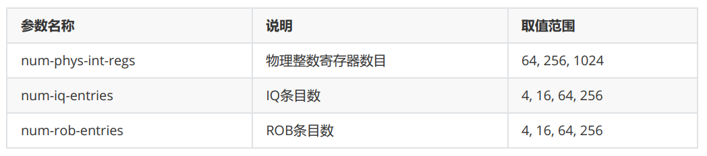
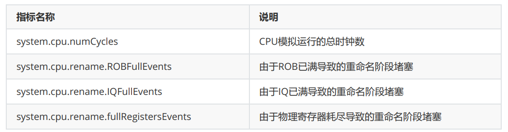

## 文件说明

- O3CPU.py: O3 CPU的配置文件，用于gem5仿真配置
- daxpy.cpp: 要仿真运行的程序源代码
- resources: 该目录下存放有帮助理解gem5/O3 CPU的资料
- run_sweep.sh：该文件是进行批次运行的文件
- plot_sweep.py：该文件是进行可视化操作的文件。
- m5out_try: 放置单次运行的结果
- sweep_out：放置批次运行的结果

## 实验步骤

### 部署gem5模拟器

参考README的说明文档即可

### 编译daxpy.cpp为RISC-V二进制文件

使用下面的命令安装交叉编译工具：
```bash
sudo apt update
sudo apt install g++-riscv64-linux-gnu
```

编译命令
```bash
riscv64-linux-gnu-g++ --static -O2 -o daxpy daxpy.cpp
```

### 使用仿真配置文件，模拟得到二进制文件

本次仿真实验获取了03 CPU在3个参数不同取值组合条件下的仿真结果，参数说明和取值范围如下：



仿真运行命令如下，对三个参数`--num-phys-int-regs`, `--num-iq-entries`, `--num-robentries`进行修改即可
```bash
[gem5.opt path] --outdir=[directory to save results] [python config path] \
-c [daxpy binary path] \
--num-phys-int-regs=[num of physical integer registers] \
--num-iq-entries=[num of IQ entries] \
--num-rob-entries=[num of ROB entries]
```

运行命令后，仿真结果会保存至`--outdir`指定目录下的`stats.txt`中，在`stats.txt`中查找CPU仿真的各项性能指标：



为了方便的测试不同的组合，下面给出批次运行的方法，如文件`run_sweep.sh`，批次运行解决。，命令如下：
```bash
cd /lab1
chmod +x run_sweep.sh
./run_sweep.sh | tee /lab1/sweep_out/run.log
```


## 代码分析

### `daxpy.cpp`

这是一段比较典型的DAXPY内核程序。首先初始化长度为`N=100000`的数组`X`和`Y`，用均匀分布随机数填充，设置`alpha=0.5`。主循环执行`Y[i] = alpha * X[i] + Y[i]`计算。本质是在gem5进行工作负载。其首先交叉编译成RISC-V的静态二进制daxpy，随后交给O3仿真执行。

### `O3CPU.py`

把 gem5 的乱序核和缓存/内存搭好，运行`daxpy`，得到结果。允许修改的命令：
- `--cmd`指定要运行的RISC-V二进制（上面编出来的 daxpy）

- `--num-rob-entries`、`--num-iq-entries`、`--num-phys-int-regs`三个实验要改的关键参数，都有默认值，可从命令行覆盖

- `--gdb-port/--gdb-wait`，默认不等GDB
默认不等待GDB调试的，同时最后输出相应的GDB状态，方便查看，如需要启用GDB，可以将该部分注释即可。

### `run_sweep.sh`

该文件是批处理的脚本，用于自动设置不同的参数值进行运行，注意仍需要关闭gdb否则会卡住无法持续运行。结果输出到`sweep_out`中，有每个组合的情况，以及总的表格。

### `plot_sweep.py`

针对PR,IQ,ROB三者，固定其中两个，分析其的收益瓶颈，以及IQ和ROB随着数量扩大的收益情况。将`sweep_out`中的表格与该代码放到同一目录下，结果会输出到`images`文件夹中。

## 命令整理

编译`daxpy.cpp`得到RISC-V可执行
```bash
riscv64-linux-gnu-g++ --static -O2 -o /lab1/daxpy /lab1/daxpy.cpp
```

单次运行
```bash
/root/gem5/build/RISCV/gem5.opt \
  --remote-gdb-port=0 --listener-mode=off \
  --outdir=/lab1/m5out_try \
  /lab1/O3CPU.py \
  -c /lab1/daxpy \
  --num-phys-int-regs=256 \
  --num-iq-entries=64 \
  --num-rob-entries=192 \
  --gdb-port=0
```

批次运行
```bash
cd /lab1
chmod +x run_sweep.sh
./run_sweep.sh | tee /lab1/sweep_out/run.log
```